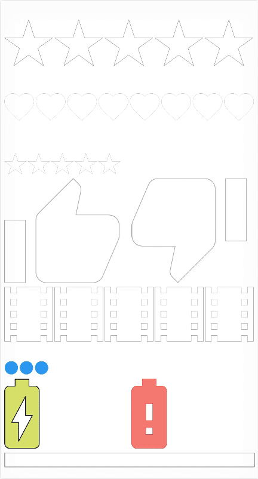

# SkiaRate



This library is using SkiaSharp to display a customisable RatingView.


## Compatibility

* UWP
* Xamarin.iOS
* Xamarin.Android
* Xamarin.Forms

## Installation

**Xamarin.iOS, Xamarin.Android, UWP, NET Standard 1.3**

[](https://www.nuget.org/packages/SkiaRate/)


**Xamarin.Forms (.NET Standard 1.3)**

[](https://www.nuget.org/packages/SkiaRate.Forms/)

## Quickstart

* UWP
```csharp
<skiarate:RatingView Count="5" ColorOn="Red" Value="3.0" />
```
* Xamarin.iOS
```csharp
view.AddSubview(new RatingView() { Frame = view.Bounds, Path = PathConstants.Heart, ColorOn = UIColor.Red});
```

* Xamarin.Android
```csharp
<skiarate.RatingView 
    android:id="@+id/ratingView1" 
    android:layout_width="match_parent" 
    android:layout_height="160dp" />
    
FindViewById<RatingView>(Resource.Id.ratingView1).Path = PathConstants.Heart;
FindViewById<RatingView>(Resource.Id.ratingView1).RatingType = RatingType.Half;    
```
* Xamarin.Forms
```csharp
<skiarate:RatingView ColorOn="#E91E63" Count="8" />
```


